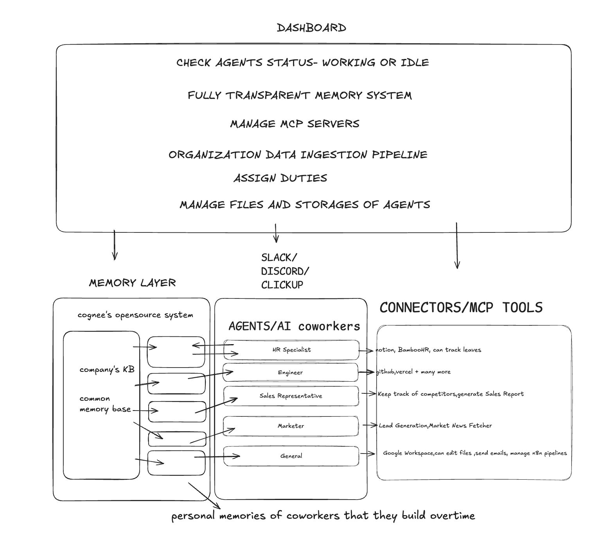
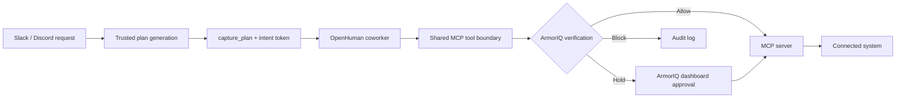

# OpenHuman

OpenHuman lets teams create AI coworkers that live inside Slack or Discord.
Each coworker has its own role, persistent knowledge graph, MCP tools, and
permissions. They can complete multi-step work across connected systems, while
ArmorIQ governs their actions so routine work runs autonomously and high-risk
or out-of-scope actions stop before execution.

## Architecture

### ArmorIQ enforcement flow

> Every MCP action passes through this shared ArmorIQ boundary. There is no
> fallback path that executes the tool directly.

## How it works

1. Define a coworker's role, personality, duties, tools, and permissions.
2. Give it company knowledge from documents, conversations, and past decisions.
3. Connect it to Slack or Discord and the MCP tools needed for its job.
4. OpenHuman captures the task plan before governed MCP actions run.
5. ArmorIQ allows routine actions and holds or blocks actions that cross the
   approved boundary.
6. Every decision is recorded for review and accountability.

## What you can build

- **An onboarding coworker** that creates accounts, assigns normal groups,
  sends welcome messages, and pauses before granting privileged access.
- **A support engineer** that recalls past incidents, follows runbooks, and
  works across ticketing and engineering tools.
- **A product expert** that connects specifications, research, and decision
  history across conversations.
- **A compliance coworker** that understands policies, flags risks, and holds
  sensitive actions for human review.
- **A sales coworker** that researches leads, prepares briefs, follows up, and
  keeps the CRM current.

## What makes it different

- **Persistent knowledge.** Coworkers retain useful organizational context
  across conversations and sessions.
- **Specialized roles.** Each coworker has its own expertise, personality,
  duties, tools, and permissions.
- **Real actions.** MCP connections let coworkers work across calendars, CRMs,
  issue trackers, databases, and internal APIs.
- **Shared enforcement.** ArmorIQ governs MCP calls at one common tool boundary
  instead of asking each coworker to supervise itself.
- **Human control.** High-risk actions can be held for approval before they
  reach the connected system.
- **Auditable execution.** Plans and tool decisions produce a reviewable trail.

## Tech stack

| Layer | Technology |
| --- | --- |
| Agent runtime | LangGraph, LangChain, OpenAI-compatible models |
| API | FastAPI, Python |
| Team interfaces | Slack, Discord |
| Tool connectivity | Model Context Protocol (MCP) |
| Action governance | ArmorIQ SDK and platform |
| Persistent knowledge graph | [Cognee](https://cognee.ai) |
| Application data | PostgreSQL, SQLAlchemy |
| Dashboard | Next.js, React |
